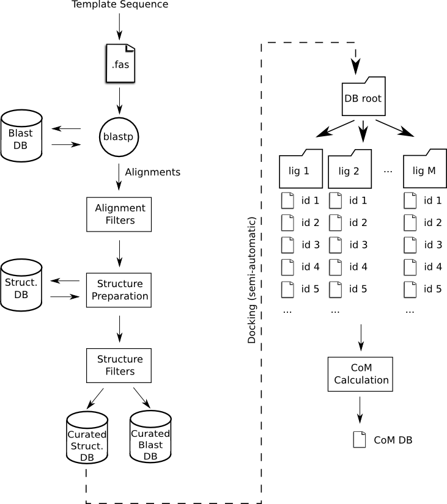

# HIV-1 Protease Induced Fit Simulation Protocol

This repository contains the source code needed to perform the (computational) experiments 
of [the paper] and  PELE++ web server queries (link).  

These tools and scripts were written with tight time constraints, evolving specifications and 
little domain knowledge. This made it difficult to fully generalize the code and have a decent test
coverage.  

## Install
This package can be installed with the usual procedure:

```Shell
> sudo python setup.py install
```
We have found that using [**pip**](http://pip.readthedocs.org/en/latest/installing.html) can be very 
convenient, as it will install this package's only dependency: [Prody](http://prody.csb.pitt.edu/). 
To use it you will have to generate the package first:  
```Shell
>  python setup.py sdist
```
and then install:  
```Shell
> sudo pip install HIVProteaseMutator-version.tar.gz
```

## Execution
Once installed you will be able to execute any of the scripts with:
```Shell
> python -m hivprotmut.SCRIPT_NAME [ARGS]
```
Were the arguments are usually one: a json configuration. Modify the example files that can be found here
in order to fit your system's setup (give special attention to the 'exec' entries).

## Project Goals
Roughly, this project had two different goals:  

1. To automate the populate and maintenance a database of HIV-1 Protease-like protein structures, filter 
and modify them following certain rules.

2. To query this database in order to find a structure template candidate, modify it to have the 
query sequence (mutate) and perform a PELE simulation.  

This package includes 5 main scripts. Only 3 of them are a direct part of the protocol.  
### Database Generation (populateDB, curateDB, blastDBIds)

#### populateDB
This aim of this script is to download the structures which Ids are listed in one or more files, and 
create a Blast Database using their sequences.  
- *db_population_params.json* - is an example of the configuration file used with this script.  
- *HIV-1_Protease.PDB.list* - contains the PDB ids of the proteins classified as HVI-1 Protease in the PDB.
- *HIV-1_Protease.mandatory.list* - contains the PDB ids of some proteins that MUST be in the database, but 
are not guaranteed to be in the other lists.


#### blastDBIds
This script can be used to retrieve the PDB ids of the results of a blast query to any database. In our case, 
we have used it to remotely query the **pdbaa** database and retrieve similar sequences to the template 
HIV-1 Protease structure.  
- *remote_blast_ids.json* - is an example of the configuration file used with this script. Note that the value
of 'blastp.extra_args' is "-remote".
- *HIV-1_Protease.blast.list* - file containing the found ids.

#### curateDB
This script generates a new structure and Blast databases with the structures from the previous DB that fulfill
certain rules, and modifies them. Then it creates a new blast database with the sequences from this structures.

 </img>

Rules for alignments:  

1. The length of the found sequence must be equal to the length of the master template sequence (99 residues per main chain).

2. The alignment must not have any gap .

3. We only want to have one hit per pdb id.

Rules 1 and 2 imply that sequence overlap must be perfect, however this can be changed in the future to allow an
initial and ending offset by relaxing rule 1.

Rules for structures:  

1. We would like to have the already docked ligand and some waters. Ligand is a "heteroatom" chain with no less
than 'pdb_preparation.min_ligand_atoms'.

2. It must have 2 main chains.

3. These main chains must have the same sequence.

4. The structure must not have any residue with certain forbidden names (in this case, ligand names)  


Rules 2 and 3 are exclusive for this type of proteins (symmetric dimer).

Any id inside the mandatory structures file ('pdb_preparation.pdb_id_exceptions') will automatically pass 
the filtering step. The preparation of this mandatory structures must be finished **manually**.

Protein preparation rules: 
1. Protein must have only the two main chains.  

2. Structure must keep only the waters closer to residue 50 of the master template (Lys). As we have two identical
chains we will have at most two water molecules. [EXTRA] In addition, the target water is the closer to the ligan. In
case there is no ligand we will use the geometrical center of the chains (we must pick "inner" waters).

3. Ligand must be preserved. Again, a ligand is considered to be a "heteroatom" chain with no less
than 'pdb_preparation.min_ligand_atoms'.  


- *db_curation_params.json* - is an example of the configuration file used with this script. 
- *db_curation_params_remote_blast.json* - is a commented (and potentially outdated!) version of the previous
file.

After this script, and for each of the structures in the new database, its ligands will be exchanged by the 
ligands under study. This means that if the database had N different structures and we want to study M ligands, 
we'll generate N x M structures. This step is performed *externally* using any protein-ligand software 
that allows automatizing bulk jobs is possible.


### Database Query (queryDB)
Given a query sequence and a ligand type, it retrieves the structure with closer sequence from the previously generated 
structure DB. Then it mutates it in order to exactly have the query sequence aa.  
It expects to find a structure database composed of M subfolders (one per ligand). Each subfolder will 
contain a complete copy of the structure database, but with a different docked ligand each. 
The mutation is performed using **Plop** to reconstruct the sidechains of the mutated residues.
The protein is then prepared using Schroedinger's Protein Preparation Wizard (Free version) and the induced
 fit simulation is performed. 

- *server_query_params.json* - is an example of the configuration file used with this script. 

### Others (copyPdbsFromList, calcLigandComOfDB)

#### copyPdbsFromList
Copies the pdb ids defined in one file from one folder to other. It expects a flat pdb database, which means that all 
pdbs are directly accessible below the DB root folder.  
Execute it with:  
```Shell
> python -m hivprotmut.copyPdbsFromList ID_LIST_PATH ORIGIN_FOLDER TARGET_FOLDER
```
Note that the target folder must exist.  

#### calcLigandComOfDB

Calculates the com of the ligands in the pdb database, storing the results in one file. queryDB will later use this file to retrieve
the Center of Mass (geometrical center of the heavy atoms indeed).

It can be executed like this:
```Shell
> python -m hivprotmut.calcLigandComOfDB DATABASE_FOLDER OUTPUT_FILE
```
